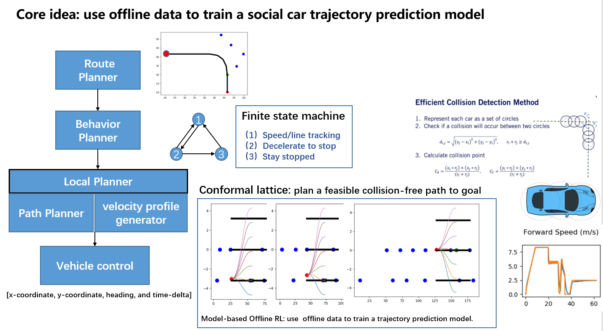
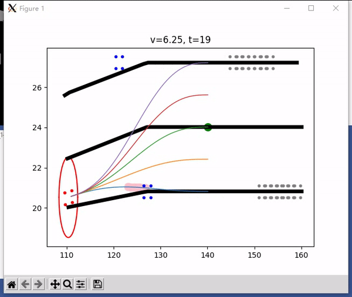

# Explanation

## 1. Core Idea

The core idea of our approach is to use the offline dataset to train a Transformer model to predict the trajectories of the neighboring social cars and then designing a motion planning method to make decisions for the ego car. 

Our model mainly contains 4 components: 
* **A route planner**, which provide the current best waypoint-path to the ego vehicle.
* **A path planner**, which uses the conformal lattice method to provide a set of candidate local paths for the ego vehicle. 
* **A Transformer-based Trajectory prediction model**, which is trained based on the offline dataset and is used to predict the future positions of the ego car's neighboring social vehicles. The model takes the vehicles' historical states as input and predict their future paths in an auto-regressive way.
* **A velocity planner**, which generates the velocity configuration for the ego car based on the available paths provided by the path planner and the predicted future paths of the social cars. The best path is selected based on the car's running speed and the safety metric.

## 2. Example 

With the predicted trajectories of the neighboring social cars, we use conformal lattice to plan a feasible collision-free path to reach the goal.

## 3. Docker Hub Link

https://hub.docker.com/repository/docker/grandpadzb/smarts_track2
